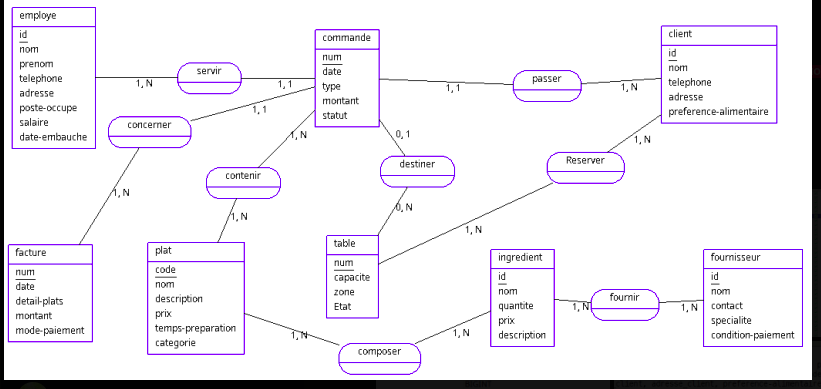

# Système de Gestion du Restaurant "Ombre d'Afrique"

## Description
Ce projet consiste en la conception et l'implémentation d'un système informatique de gestion pour le restaurant "Ombre d'Afrique" situé à Abéché. La solution permet de gérer les commandes, les clients, les employés, les tables et les fournisseurs de manière efficace.

## Fonctionnalités Principales
- **Gestion des commandes** (sur place, à emporter, livraison)
- **Suivi des clients** et de leurs préférences
- **Gestion du personnel** (serveurs, vendeurs, directeur)
- **Administration des tables** (état, capacité, zone)
- **Catalogue des plats** avec détails complets
- **Facturation** automatique avec calcul des taxes
- **Relations fournisseurs** et gestion des approvisionnements

## Structure de la Base de Données
La base de données comprend les tables suivantes :
- `CLIENT` - Informations clients
- `EMPLOYE` - Données du personnel
- `COMMANDE` - Enregistrement des commandes
- `TABLE_RESTO` - Gestion des tables
- `PLAT` - Menu du restaurant
- `FACTURE` - Transactions financières
- `FOURNISSEUR` - Partenaires d'approvisionnement

## Installation

### Prérequis
- Serveur MySQL (version 8.0+ recommandée)
- Outil de gestion de base de données (MySQL Workbench, phpMyAdmin, etc.)

### Procédure d'installation
1. Créer une base de données nommée `resto`
2. Importer le fichier SQL :

